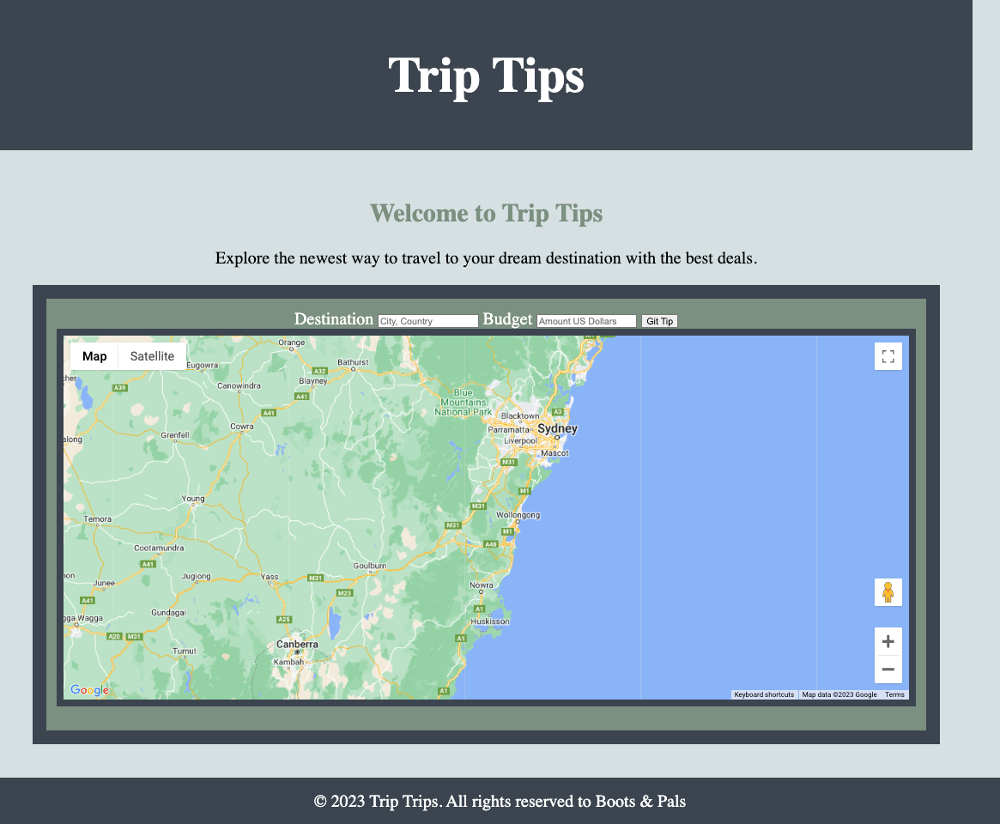
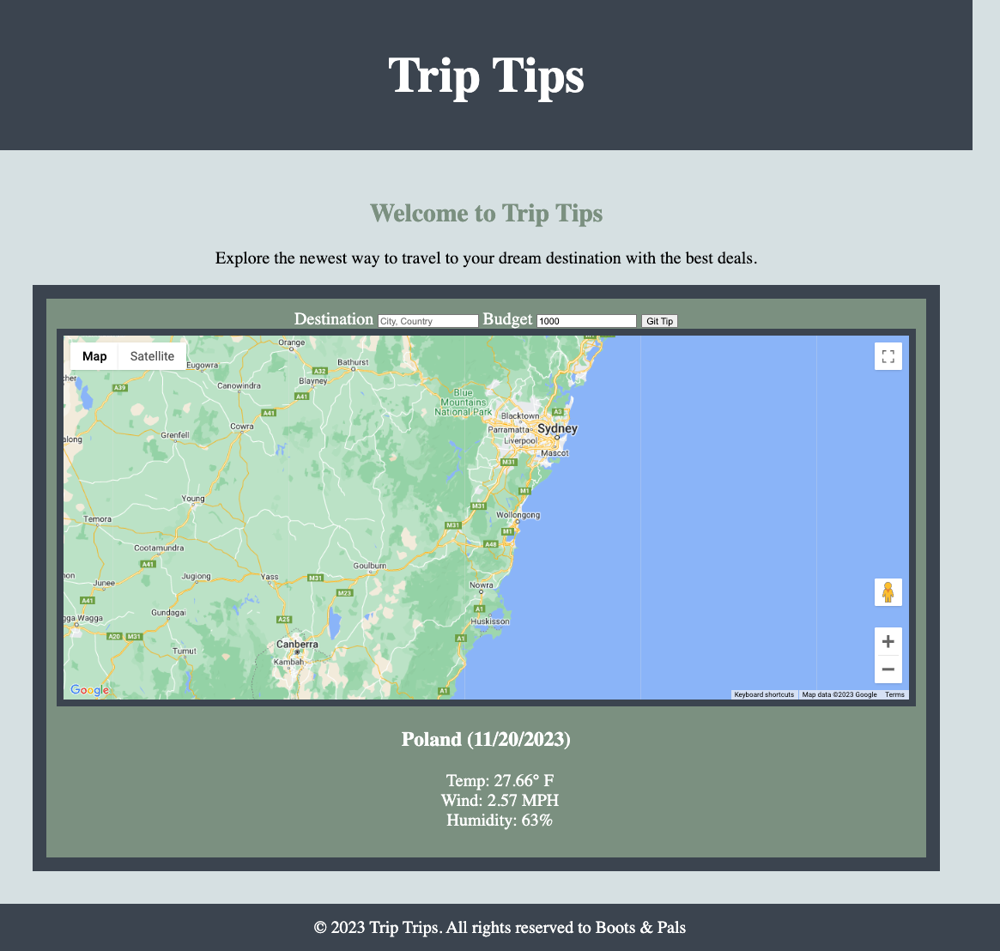
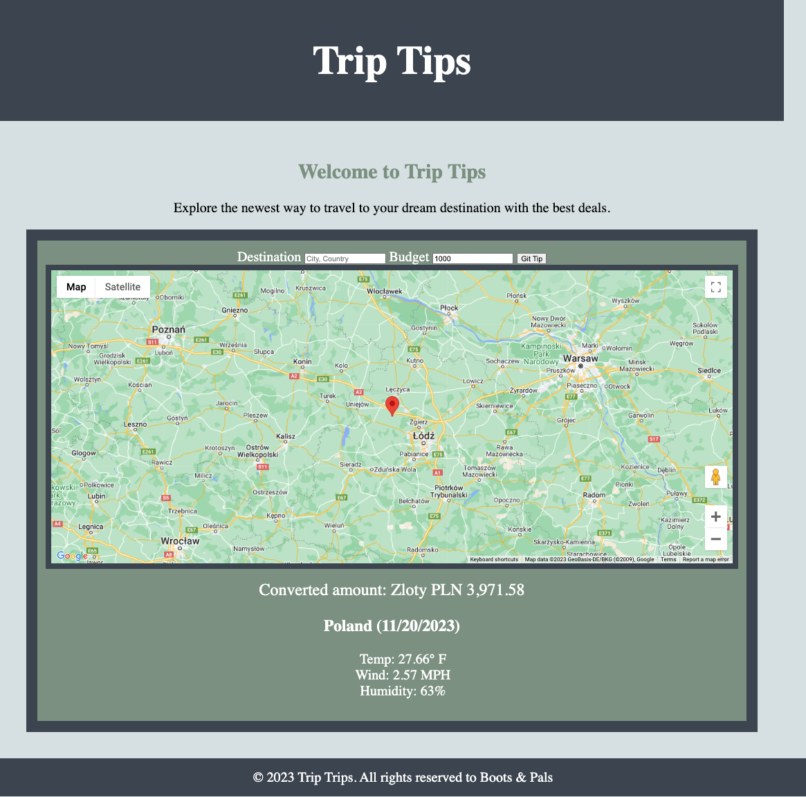

# Trip Tips

## Description
Using the skillsets learned over the last 6 modules and applying them to our website Trip Tips. This applicatiohn will allow users to look up a travel destination and get the weather, location, and currency from USD.

## Acceptance Criteria
* When I open up browser it takes one to "Trip Tips" main page
* I am then able to put in my desired destination and the date and weather will show
* I then add my budget and click "Git Tip"
* This will then allow the map to change to my desired destination
* And show the currency within my desired destination
* It will also show the date and weather
* After clicking "Git Tip" it will show me everything I need to know
* This will save within local storage
* And I will be able to continue to look at different destinations.

## Trip Tips Screenshots 

Main Page to Trip tips

Desired Destination: Poland
Showing date and weather

After clicking "Git Tip", map will move to desired destination and show currency change, date, and weather.

## Link to Deployed Attributes
https://project1team2jss.github.io/Trip-Tips-With-Pals/

## About the Team
Pals n' Boots
* Jenni: hjipark22@gmail.com / hjenp22
* Sean: seanharrigan8@gmail.com /seanharrigan8
* Stuart: stuartgosborn22@gmail.com / stuartgosborn

  

© 2023 Trip Trips. All rights reserved to Boots & Pals
